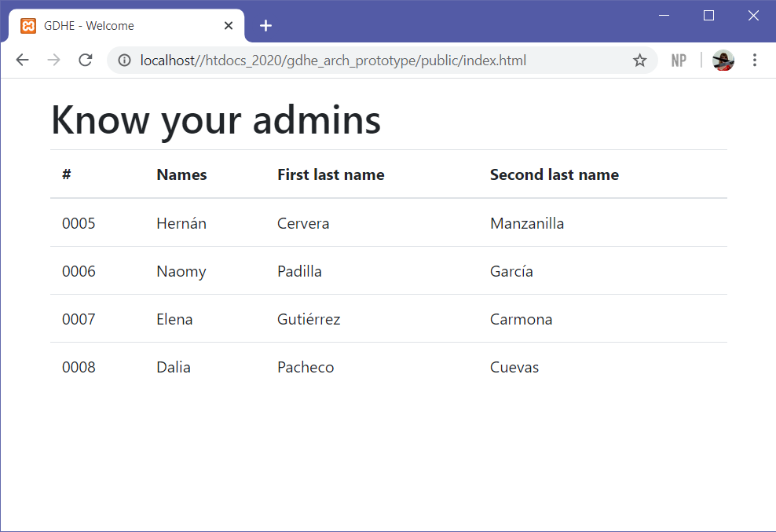
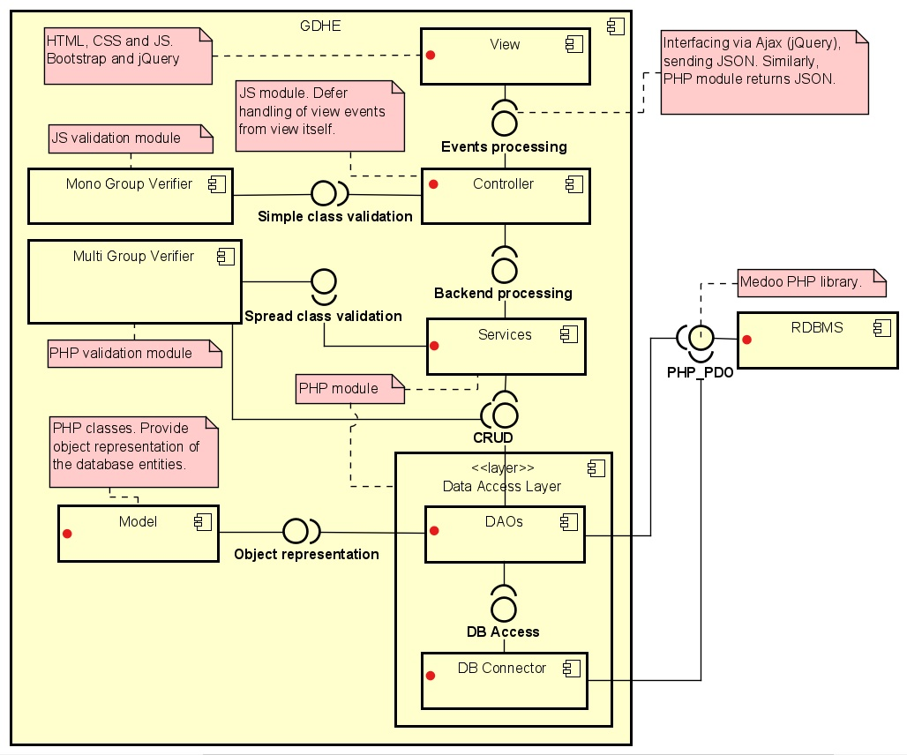

# GDHE Architecture Prototype

> This README is very likely to not be up to date since the purpose of this repo is to rapid fire the implementation of architecture and design ideas.

This project is a small prototype, as a proof of concept, to test an MVC architecture. The frontend looks like below.

    

## Architecture

The general architectural pattern followed is MVC. A data access layer is provided to separate the controller from DB specific operations. The DAL is tightly coupled with [Medoo](https://medoo.in/), every frontend-backend communication is done via a Controller, utilizing Ajax and JSON. **The red dots are prototyped in this project**.

    

